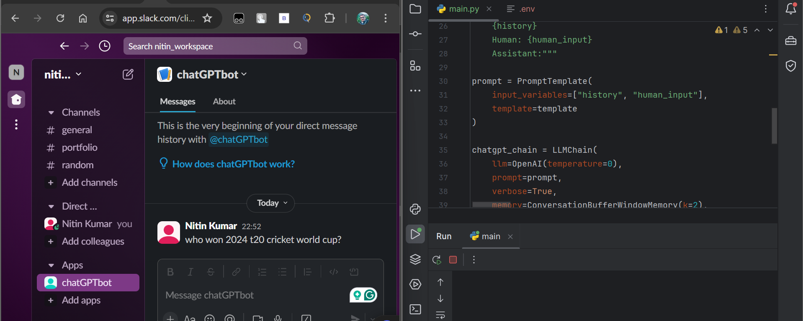

# Slack chatGPT AI bot

## Features

> 1. OpenAI chatGPT bot for [Slack app](https://app.slack.com/) mostly used in corporate  
> 2. This bot is another app to be used as a chatGPT integrated there  
> 3. .env file for all generated tokens (Create 1 .env file with the 3 variables mentioned in Tokens used section)  

## Working

## Tokens used

1. SLACK_BOT_TOKEN
2. SLACK_APP_TOKEN
3. OPENAI_API_KEY

## Applications used 

1. [Slack web app](https://app.slack.com/)  
2. [Chat GPT](https://platform.openai.com/)
 
## How to's 

### 1. Generate OpenAI token 

Step 1: Navigate to [openAI web app](https://platform.openai.com/settings/profile?tab=api-keys)  
Step 2: Login and click on **Create new secret key** button  
Step 3: Provide a name to the token to be generated & click on **Create secret key** button  
Step 4: Paste the token hence generated

### 2. Create & configure app in slack 

Step 1: Navigate to [Slack API web app](https://api.slack.com/apps?new_app=1)  
Step 2: Click on **Create New App** button  
Step 3: Click **from scratch** >> provide App name >> Select the workspace from your profile >> Click on **Create App**  
Step 4: Go to **OAuth & Permissions** from left menu bar >> Add Bot token scopes (chat:write & chat:write.public)  
Step 5: Click on **Install to workspace**  >> Click **Allow** button  
Step 6: Copy the **Bot User OAuth Token** hence generated  
Step 7: Go to **Basic Information** >> App-Level Tokens >> Generate Token and Scopes >> Provide any token name >> Add Scope (connections:write) >> Click on **Generate**  
Step 8: Copy the token hence generated
Step 9: Go to **Socket Mode** & enable socket mode
Step 10: Go to **Interactivity & Shortcuts** & enable it(if not already)  
Step 11: Go to **Event Subscriptions** >> enable **Enable Events** >> Click on **
Subscribe to bot events** >> Add Bot user events (message.im & app_mention) >> Click on **Save Changes**  
Step 12: Now, reinstall the app (As we've done in step 5)  
Step 13: Go to **App Home** >> Enable **Allow users to send Slash commands and messages from the messages tab**  

## How to run

1. First run the python script
2. Then, navigate to the slack web app and type the prompt  
3. You'll get response in slack web app  

## Bibliography

[Youtube Video](https://youtu.be/Luujq0t0J7A?si=-oDoNHTGj9XbVEHo)  
[GitHub Repo](https://github.com/patilanirudh/Slack_bot)  

thanks to @patilanirudh

## Author

[Nitin Kumar](https://linkedin.com/in/nitin30kumar/)  

